<small>University of Freiburg 
Faculty of Engineering 
Bioinformatics Group 

Master Thesis</small>

##### **Development and evaluation of Galaxy pipelines for detection of SARS-CoV-2 variants by genomic analysis of wastewater samples**

<small>
<b>Author: </b> Polina Polunina 
<b>Examiner: </b> Prof. Dr. Rolf Backofen 
<b>Second Examiner: </b> Prof. Dr. Wolfgang R. Hess 
<b>Advisors: </b> Dr. Bérénice Batut, Dr. Wolfgang Maier 

<b>Date:</b> 24.11.2022</small>

Note:
- I want to welcome you all to the presentation of my master thesis 'Development bla-bla ..' which I worked on with the supervision of Dr. Bérénice Batut, Dr. Wolfgang Maier

<!-- ---

Table of contents

### Table of contents
- **Introduction**
- **Methods** (Workflows, Datasets)
- **Results** (Mock, Real-world datasets)
- **Discussion** (Limitations, Next steps)
- **Summary**

 -->

---

Introduction

## Introduction

<small>SARS-CoV-2 evolution</small>
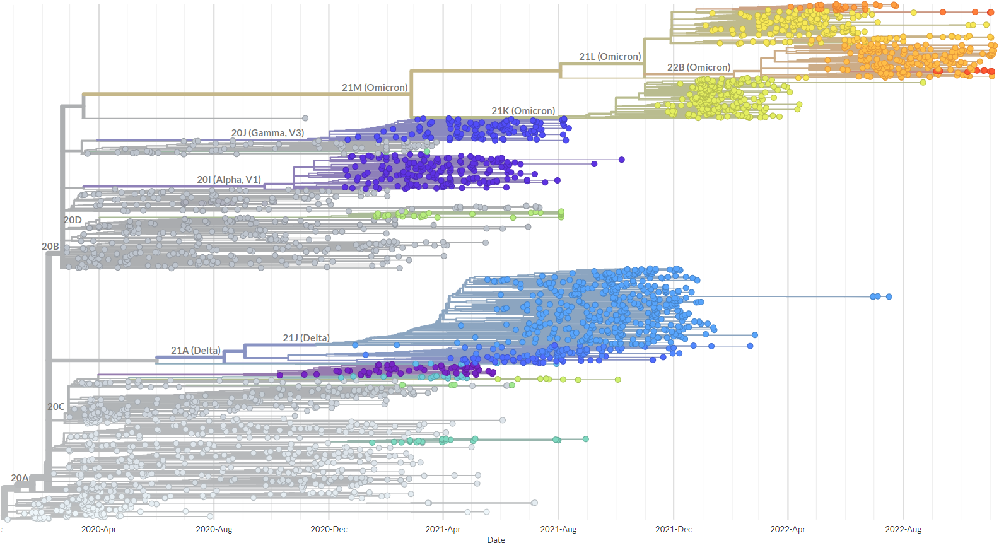
<small style="position: absolute; right: 0%; font-size: 0.2em; bottom: -0.5%;">Source: nextstrain.org</small>

<small>SARS-CoV-2 geography</small>
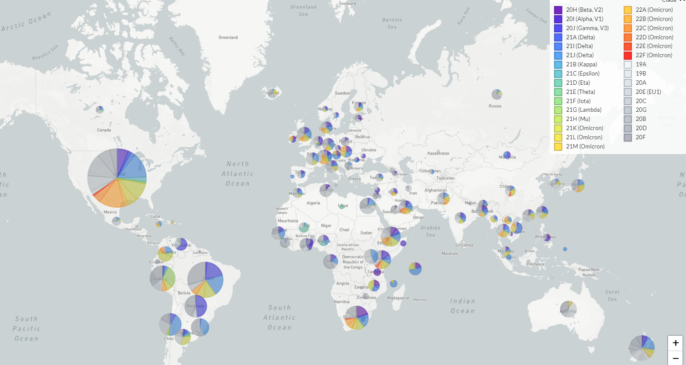
<small style="position: absolute; right: 0%; font-size: 0.2em; bottom: -0.5%;">Source: nextstrain.org</small>

Note:
- 1
- Almost 3 years after the first report of SARS-CoV-2 in Wuhan, China, more than 640 million people affected by SARS-CoV-2 pandemic. 
- SARS-CoV-2 is a virus that causes COVID-19 disease. 
- In the first year of the Coronavirus pandemic, the virus did not change much. 
- From approximately spring of 2020 on, SARS-CoV-2's evolution tree grew increasingly complex.
- Different branches appeared for a number of variants: Omicron, Gamma, Alpha, Delta and others. 
- Researchers track the SARS-CoV-2 variants with mutations that are clinically or epidemiologically significant. 
- Detecting variants in a virus is important to determine if new variants are emerging or existing ones are spreading. 
- In particular, variants with the potential or demonstrated ability to be more transmissible, immune evasive have to be tracked.
- Loads of data are being submitted regularly (more than 4000 unique labs submitting data to the GISAID database) and have to be immediately analyzed to monitor emergence and spread of new variants as well as understand the viral evolution dynamics.
- 2
- SARS-CoV-2 variants are spread worldwide. 
- However, it is often the case that some variants occur in remote areas without adequate infrastructure or in political situations that make unbiased sars-cov-2 surveillance impossible.

------

SARS-CoV-2 clinical surveillance

### SARS-CoV-2 clinical surveillance

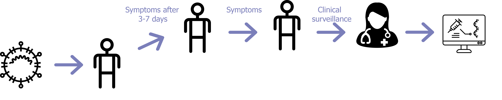

Note:
- A variety of surveillance techniques are available for SARS-CoV-2. 
- Clinical testing is one of the most potent and widespread method for sars-cov-2 surveillance. 
- Schematic diagram shows the process of detecting viruses by clinical surveillance, from the infection moment to bioinformatics data analysis
- **do not explain!**

------

### SARS-CoV-2 clinical surveillance

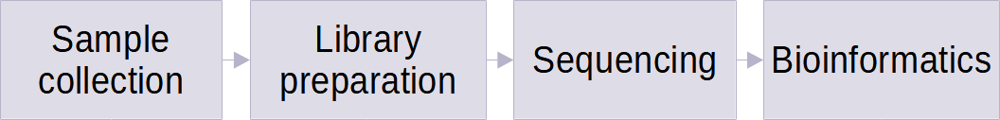

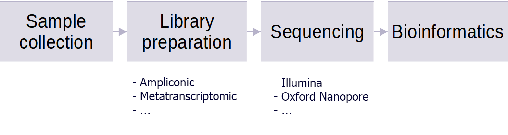

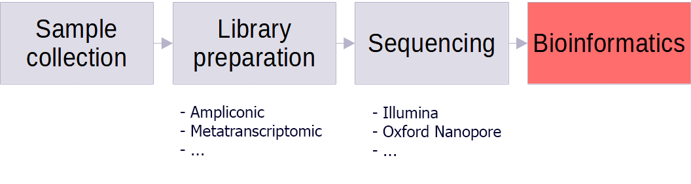

Note:
- 1 
- Here is a simplified process that raughly represents sars-cov-2 surveillance. 
    - Sample collection
    - Library preparation that can vary depending on type of biological data and final objectives
    - 2
    - sequencing, where different techniques are available to choose depending on data and objectives
    - bioinformatics step intended for downstream analysis, at this step we try to identify sars-cov-2 and different variants present in collected samples using different bioinf tools
- 3
- Lets look at Bioinformatics part a bit more in detail

------

### SARS-CoV-2 clinical surveillance

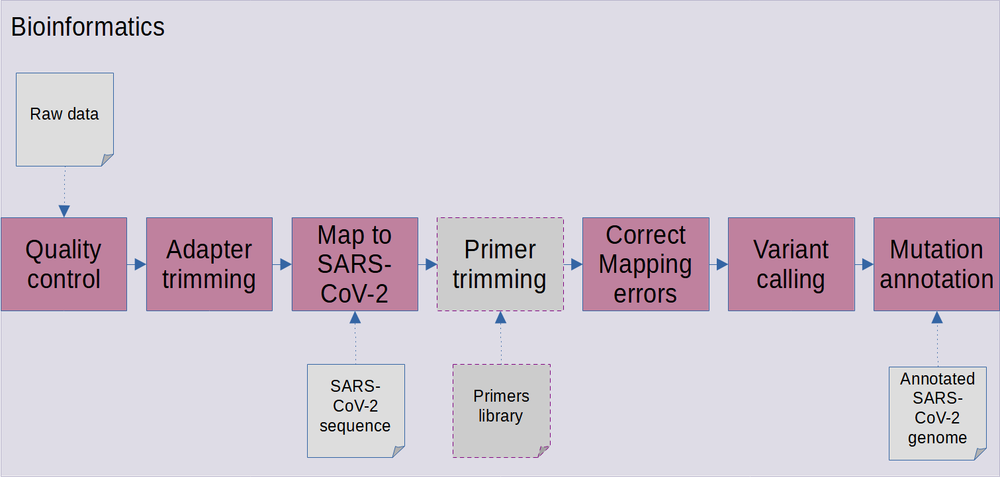
<small>Main steps to be done for bioinformatics of SARS-CoV-2 surveillance</small>

Note:
- Here is simplified process of bioinformatics steps used to analyze sequenced data for sars-cov-2 surveillance.
- Tools can differ from one pipeline to another.
- But the main steps, in general, are more or less the same.
- talk about steps (raw data are sequencing data)
- primer trimming, is a specific step for ampliconic datasets. The auxiliary file is used for this step - a BED file specifying the primers used during amplification.
- variant calling should be run where variants from sequence data are identified.
- Variant calling step is followed by mutation annotation. The data is not changed; here, only format is changed to be more readable.

------

Galaxy effort

### Galaxy effort for clinical surveillance

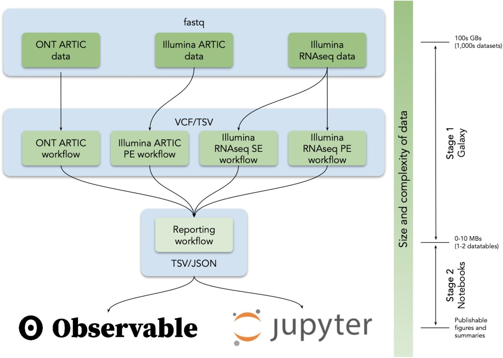
<small style="position: absolute; right: 0%; font-size: 0.2em; bottom: -1%;">Source: Maier et al., 2021</small>

Note:
- 1
- Galaxy is one of the platforms for data analysis that provides transparency, accessibility, reproducibility
- In order to respond global SARS-CoV-2 emergency, based on Galaxy, there were developed **4 workflows** for clinical SARS-CoV-2 data surveillance
- point to input data, then to 4 workflows in picture
- These Galaxy workflows suggested by Wolfgang Maier and collegues depend on type of input data, library preparation technique used to extract input data and sequencing technology used to obtain reads.

------

### Galaxy bots

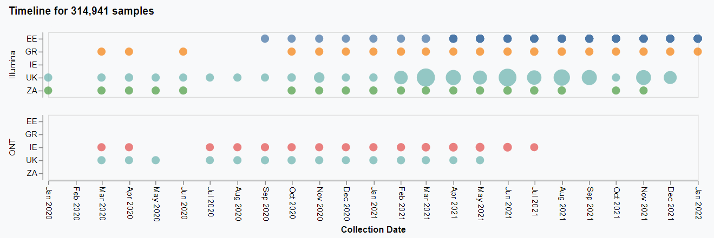
<small style="position: absolute; right: 0%; font-size: 0.2em; bottom: -1%;">Source: galaxyproject.org/projects/covid19</small>

Note:
- In addition to 4 workflows, Galaxy team has developed **bots** to assist in SARS-CoV-2 surveillance, a viable tool for automating the analysis of a large number of SARS-CoV-2 sequences regularly.

------

Wastewater surveillance

### Wastewater surveillance

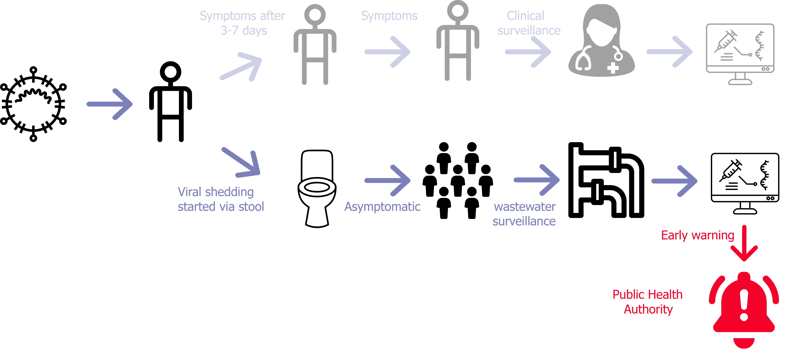

Note:
- However, classical clinical sars-cov-2 surveillance has some **drawbacks**:
    - it can **take long** to detect variants in samples as it needs the patient to get **symptoms** and come to be tested
    - it's **costly** because involves **clinitians**
- wastewater surveillance is another surveillance method for sars-cov2 that can be a **good solution** that does **not need clinitians** don't require patent to have **symptoms** to collect samples
- wws has received extensive public attention as a passive monitoring system that complements clinical surveillance.
- Schematic diagram shows the process of detecting viruses by WWS against clinical surveillance.
- upper branch shows a clinical surveillance of sars-cov-2, from the infection moment to bioinformatics data analysis
- lower branch, in turn, represents wastewater surveillance
- **do not explain long!**

------

Aim of the thesis

### Aim of the thesis

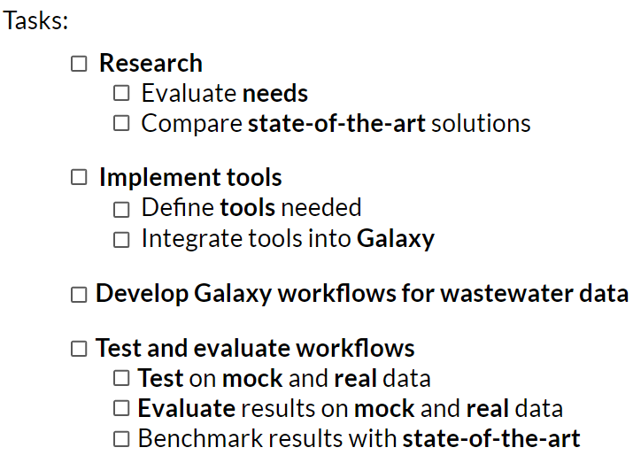

Note:
- In this master thesis, I aim to provide a complete, accessible workflow based on Galaxy that can ensure data analysis reproducibility, transparency and regularity.
- for this purpose, I identified the tasks that I intended to complete in this thesis
- DEVELOP: I intended to adapt the Galaxy workflows developed for clinical data to process wastewater data, 
    - taking subworkflows for preprocessing data, 
    - improving these subworkflows.
    - then, integrate existing tools for sars-cov-2 lineages abundances analysis in wastewater samples
- then, test these workflows on mock datasets as well as real datasets, and benchmark them against each other and with other solution offered by other researchers.

---

State-of-the-art

### State-of-the-art

<small>Individual tools</small> 

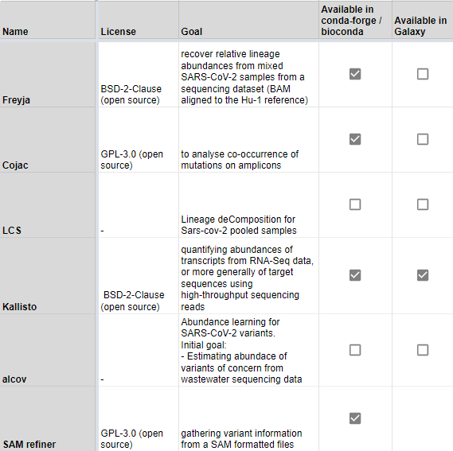

<small>Individual tools</small> 

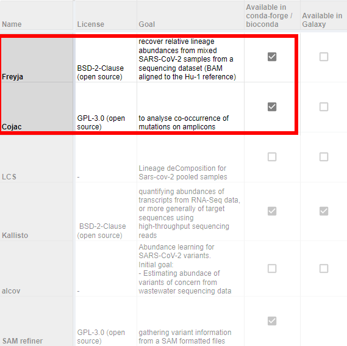

Note:
- 1
- various state-of-the-art methods already presented to the public
- They can be divided into: 
    - 1) individual tools which require data preprocessing before sars-cov-2 lineages detection;
    - some of these tools were developed for sars-cov-2, like cojac and freyja
    - some were repurposed to sars-cov-2, like kallisto (was initially developed for quantifying abundances of transcripts from RNA-Seq data)
    - 2
    - **for this thesis COJAC and Freyja** were chosen because they have open source licence, they are available in Bioconda, they already showed decent results, and are focused on sars-cov-2 lineages abundances detection that can be implemented into Galaxy pipelines

------

### State-of-the-art

<small>Standalone pipelines</small> 

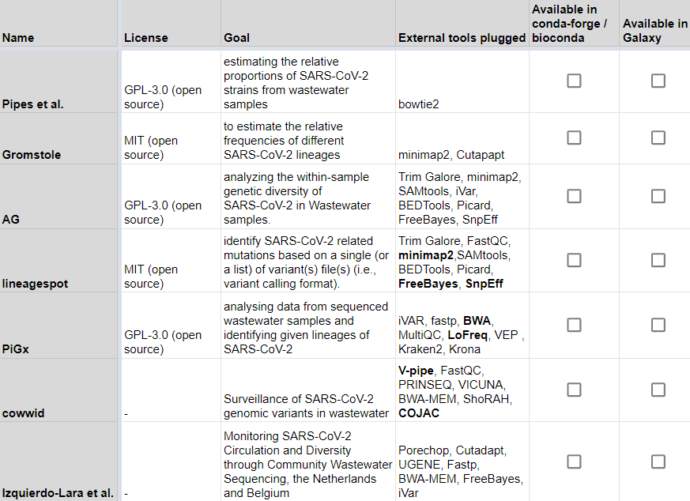

Note:
    - 2) standalone pipelines that provide the entire analysis from raw data to lineages abundances detection
    - different pipelines uses different tools
    - lineagespot uses minimap for mapping, freebayes for variant calling and snpeff for mutation annotation
    - pigx uses BWA for mapping, lofreq for variant calling and VEP for mutation annotation
- state-of-the-art methods have differences in their goals, models, tools used and outputs

---

Methods

### Methods

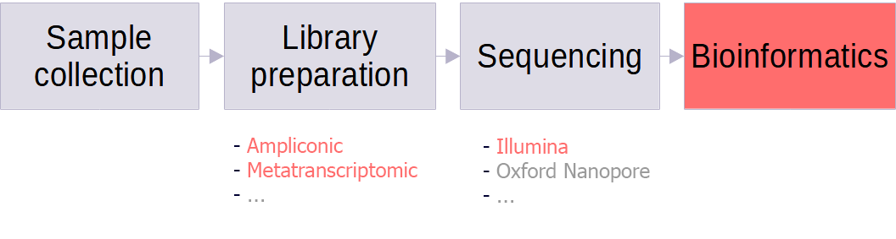

Note:
- 1
- In this thesis I focused on the bioinformatics step for sars-cov-2 wastewater surveillance
- 2 wfs were created based on input data: illumina-ampliconic + illumina-metatranscriptomic
- now i want to have a look at both workflows

------

### Methods

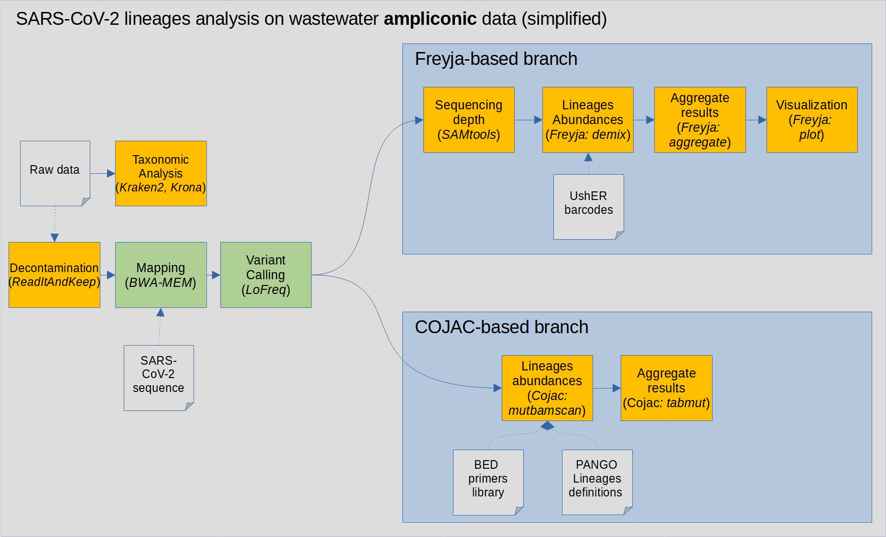

Note:
- I highlighted in yellow the blocks added by me as part of the work on this thesis. 
- first wf was built for ampliconic input data
- talk about extra steps and then branches (steps in branches)
- wrappers were written with planemo (a command-line application for creating Galaxy tools, workflows, and deploying tools to Galaxy)
- I put a lot of effort into creating the user interface of these tools in Galaxy so that they are available for use outside of these special workflows

------

### Methods

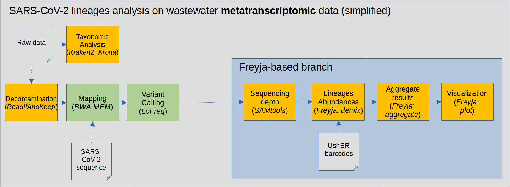

Note:
- second wf was built for metatranscriptomic data
- only freyja, cojac was not used because cojac can work only fro ampliconic data

------

Datasets

### Datasets

Workflows were tested on:
- **Mock** dataset (**100** samples)
    - Single lineage
    - Two lineages
    - Three lineages
- Four **real-world** datasets (overall, **817** samples)

Note:
- Mock dataset was generated by working group for Benchmarking of wastewater surveillance pipelines
- by obtaining genomes from Pango designation list

---

Results

## Results

------

Results on mock dataset

### Results on mock dataset
#### Single lineage expected

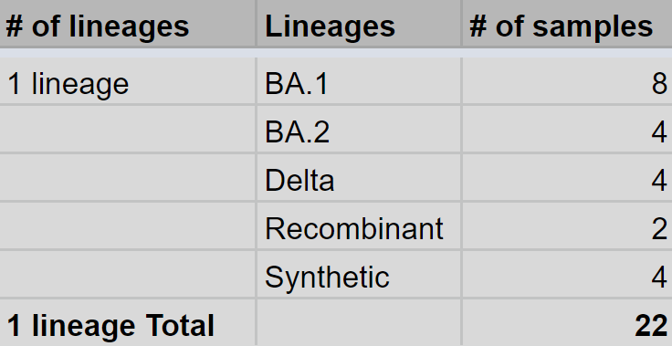

Note:
- First I analyzed results for samples that contain only one lineage
    - while generation of mock dataset focus was on 3 real lineages Delta, BA.1, BA.2, 
    - recombinant (lineages combined from 3 lineages)
    - synthetic lineage to mimic the effect of unknown lineage;
    - (opt) Synthetic amplicons created using ARTICv4.1 primers
    - (opt) Synthetic reads created using error models based on 150 or 250bp NovaSeq reads

------

### Results on mock dataset
#### Single lineage expected

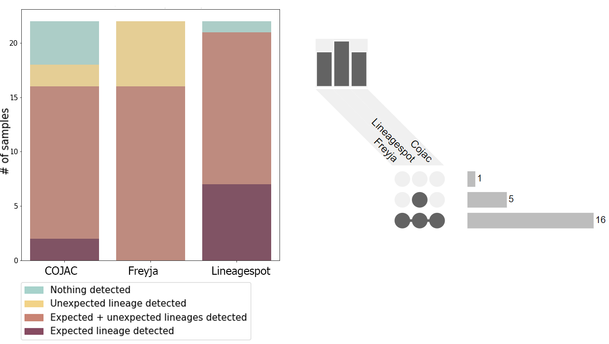

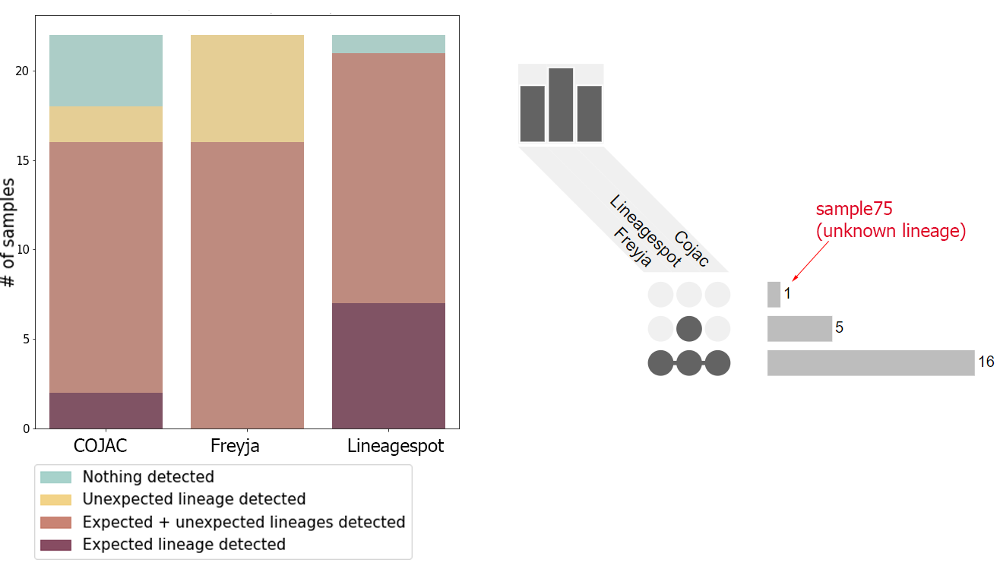

Note:
- 1
- **Barplot:**
- I analyzed separately samples were **single lineage** was expected. 
- compared results from **COJAC**-based and **Freyja**-based Galaxy workflows with **Lineagespot**.
- (brown and purple) 
    - All three tools are  quite effective in detecting expected lineage. 
    - Nonetheless, in discerning **only expected** lineage and nothing more, **Lineagespot** performed the best, compared to COJAC and Freyja. 
    - **Freyja** is effective at detecting expected lineage; however, it always detected some **unexpected lineages**. 
    - **COJAC** results are close to Freyja results, but COJAC was able to detect 2 samples with the expected lineage. 
- (yellow and blue) 
    - In 6 samples out of 22 Freyja and COJAC detected either unexpected lineages or nothing 
- **Venn upset diagram:**
- intersections between sets of results and determined which samples were correctly detected by which tool (in terms of the lineages expected) and how similar the results were between tools.
- Each column corresponds to a set of obtained results from certain tools (COJAC, Lineagespot, Freyja), and bar charts on top show the size of the set of tool’s results. 
- 2
- The first row in the figure is completely empty, while 1 sample is expected to be detected but was not. This specific sample is expected to contain only unknown synthetic lineage.

------

### Results on mock dataset
#### Single lineage expected

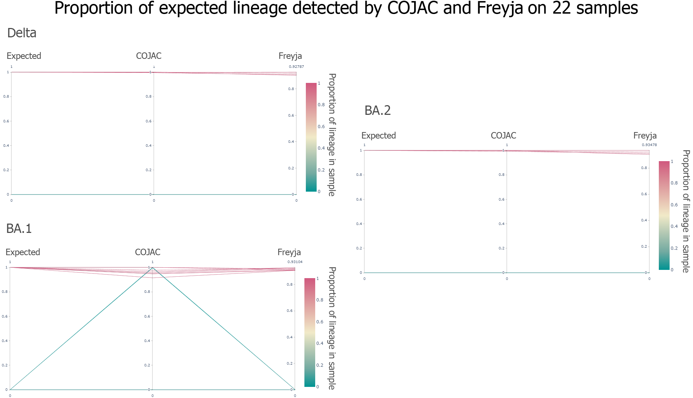

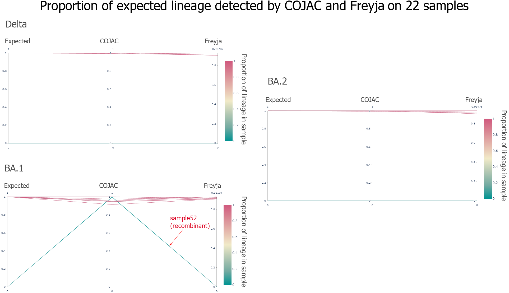

Note:
- 1
- I looked at **lineage proportions** detected by Freyja and COJAC compared with expected proportion.
- Plots were produced on **22** samples where **single lineage** was expected
- One plot per lineage: Delta, BA.1, BA.2 
- The left axis represents the expected proportion of the lineage, the middle axis represents the proportion of the lineage detected by COJAC, while the right axis represents the proportion of the lineage detected by Freyja.
- Overall, proportions of lineages expected and detected by COJAC and Freyja close to each other
- 2
- In one curious case:
    - for 1 sample, BA.1 lineage was not expected but COJAC detected its proportion close to 1.
    - This sample containg recombinant of all 3 lineages (Delta, BA.1, BA.2).
    - it was expected to detect the recombination of three lineage mutations (BA.1, BA.2, and Delta) but COJAC misinterpreted results for this sample.

------

### Results on mock dataset
#### Two lineages expected

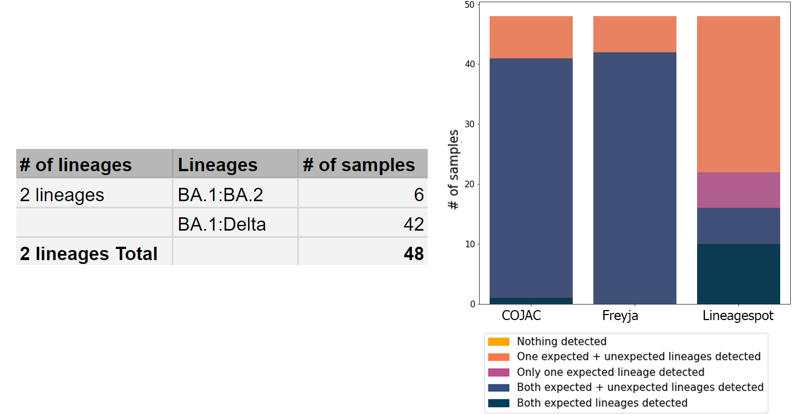

Note:
- table shows information about generated samples with 2 lineages
- **Barplot**
- The same analysis was done for 48 samples of mock dataset where 2 lineages were expected.
- (blue) In this case COJAC and Freyja showed adequate results in detecting both expected lineages.
- (dark blue) Lineagespot, in turn showed less efficient results, however, in terms of detection only 2 expected lineages and nothing more Lineagespot performed better.

------

Results on real-world dataset

### Results on real-world dataset

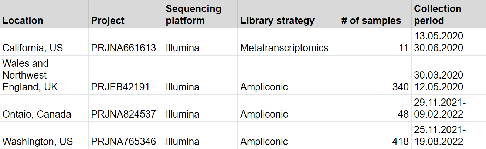

Note:
- short description of real datasets; **US - for bots**
- In order to provide a fairly **comprehensive** analysis, real-world datasets for experiments in this thesis were selected in such a way that they cover a variety of locations in the world and different time points of collecting samples. 
- in this presentation - focus on **UK** dataset
- Four datasets: 
- i) one dataset from California where the samples were collected in 2020 
- ii) a dataset from the UK, with data collected in sewage across six major urban centers in the UK (with a total population equivalent of 3 million) around the same time period (late spring - early summer of 2020) as the Californian dataset
- iii) a dataset from wastewater treatment facilities across Ontario, Canada collected in the end of 2021 and beginning of 2022
- iv) a dataset from the US, one of the most extensive dataset with 418 samples already and regularly new samples are being added (last samples being from October of 2022). This dataset would be interesting to connect to Galaxy bots for regilar analysis

------

#### UK dataset

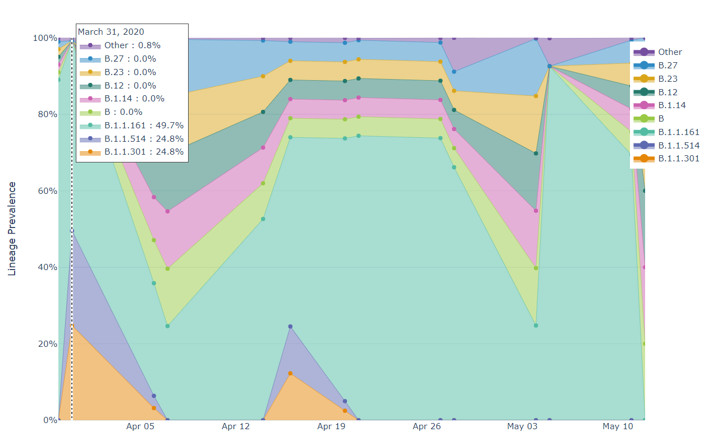

Note:
- After getting results on UK dataset dashboard was generated to show lineage prevalence in samples
- Interestingly, B.1.1.514 and B.1.1.301 lineages were in wastewater samples at the end of March 2020, and in April 2020.
- In Pango database they were registered on 1 and 22 May 2020, respectively.
- This fact proves earlier detection within wastewater surveillance over clinical surveillance.

---

Discussion

### Discussion

Limitations

**Freyja-based workflow:**
- detects unexpected lineages
- when too many lineages - issues with plotting

**COJAC-based workflow:**
- for ampliconic datasets only
- can misinterpret recombinants

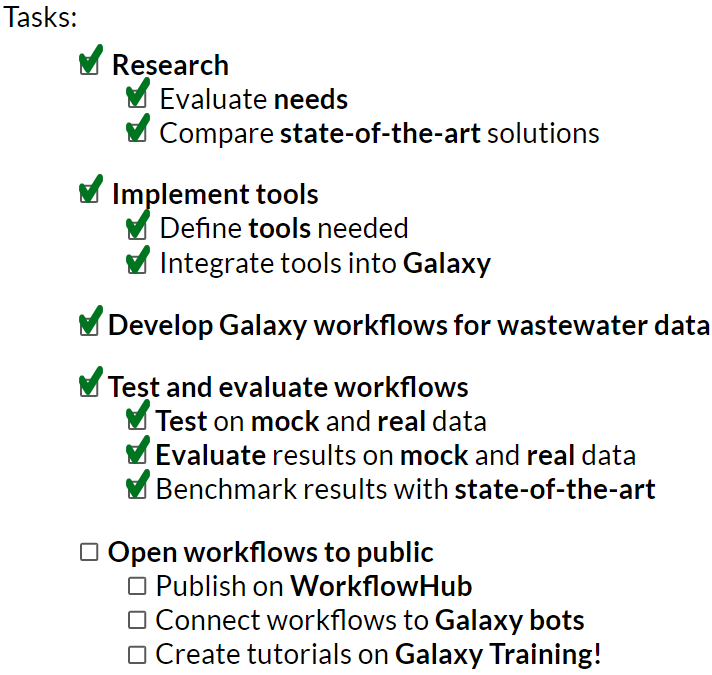

<small><b>Globally:</b> repurpose to other wastewater genomic surveillance</small>

Note:
- 1
- limitations
- 2
- returning to the tasks that I set while working on the master thesis and again list what was done as well as the next steps
- (opt) WorkflowHub is a registry for describing, sharing and publishing scientific computational workflows. The registry supports any workflow in its native repository. WorkflowHub aims to facilitate discovery and re-use of workflows in an accessible and interoperable way. This is achieved through extensive use of open standards and tools, including Common Workflow Language (CWL), RO-Crate, BioSchemas and TRS, in accordance with the FAIR principles.
- (opt) FAIR Findability, Accessibility, Interoperability, and Reusability foundational principles.
- poliovirus
- In recent two years, increased public awareness of any suspicious virus, including poliovirus, and ubiquitous usage of wastewater surveillance of poliovirus are preventing any cases of paralysis following the recent re-emergence of polio in New York

---

Summary

### Summary

 <small>

- **Two workflows** for SARS-CoV-2 **clinical** data repurposed to **wastewater** data:
    - Ampliconic-Illumina
    - Metatranscriptomic-Illumina
- **Freyja** and **COJAC** implemented into Galaxy
- **Evaluation**:
    - Tested on **mock** and **real** data
    - Benchmarked with **Lineagespot**
- **Limitations**: 
    - detection of unexpected lineages
    - misinterpretation of recombinants
- **Overall**: promising results
- **Next steps**: publish on WorkflowHub, connect to Galaxy bots, training materials

</small>

------

### Thanks to:

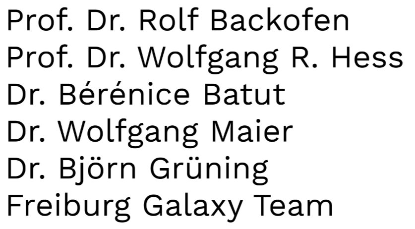

Note:
- I want to thank **read names of people** for giving me the opportunity to write my master thesis and for the support they provided me while working on the thesis

---

Thanks for your attention!

------

### Summary

<small><b>Development and evaluation of Galaxy pipelines for detection of SARS-CoV-2 variants by genomic analysis of wastewater samples</b></small>

 <small>

- **Two workflows** for **clinical** data repurposed to **wastewater** data:
    - Ampliconic-Illumina
    - Metatranscriptomic-Illumina
- **Freyja** and **COJAC** implemented into Galaxy
- **Evaluation**:
    - Tested on **mock** and **real** data
    - Benchmarked with **Lineagespot**
- **Limitations**: 
    - detection of unexpected lineages
    - misinterpretation of recombinants
- **Overall**: promising results
- **Next steps**: publish on WorkflowHub, connect to Galaxy bots, training materials

</small>

