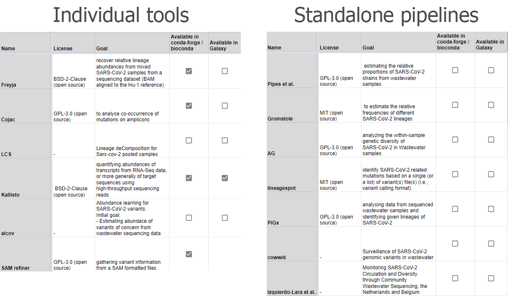
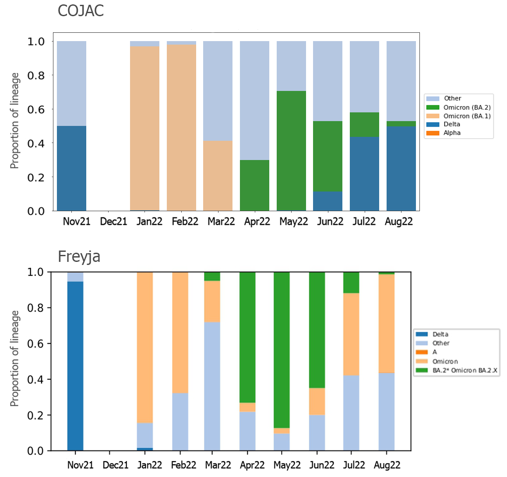
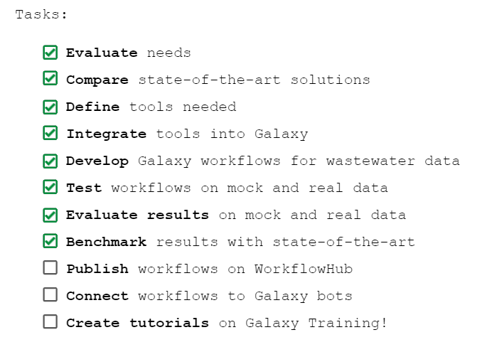

<small>Albert-Ludwigs University Freiburg</small>

<small>Department of Computer Science</small>

<small>Bioinformatics Group</small>

<small>Master Thesis</small>

##### **Development and evaluation of Galaxy pipelines for detection of SARS-CoV-2 variants by genomic analysis of wastewater samples**

<small>Author: Polina Polunina</small>

<small>Examiner: Prof. Dr. Rolf Backofen</small>

<small>Second Examiner: Prof. Dr. Wolfgang R. Hess</small>

<small>Advisors: Dr. Berenice Batut, Dr. Wolfgang Maier</small>

---

Table of contents

### Table of contents
- **Introduction**
- **Methods**
    - Workflows
    - Datasets
- **Results**
    - Mock dataset
    - Real-world dataset
- **Discussion**
    - Limitations
    - Next steps
- **Summary**

---

Introduction

## Introduction

<small style="position: absolute; right: 0%; font-size: 0.2em; bottom: -1%;">Source: nextstrain.org</small>

Note:
- >640 million people affected by COVID-19 pandemic. SARS-CoV-2 is a virus that causes COVID-19 disease. In the first year of the Coronavirus pandemic, the virus did not change much. From approximately summer of 2020 on, SARS-CoV-2’s family tree grew increasingly complex.
- The main trunk sprouted branches for a number of variants. Gamma, lambda, and mu variants appeared (although none spread worldwide). The tree’s canopy was formed by dozens of branches (fig). Researchers track the SARS-CoV-2 variants with mutations that are clinically or epidemiologically significant. Detecting variants in a virus is important, one can determine if new variants are emerging or existing ones are spreading. In particular, variants with the potential or demonstrated ability to be more transmissible, immune evasive. On-going pandemic control efforts are challenged by the emergence of SARS-CoV-2 variants with greater transmission potential and/or immunity circumvention.
- wastewater surveillance has received extensive public attention as a passive monitoring system that complements clinical surveillance.
- >4000 unique labs submitting data to the GISAID database data have to be immediately analyzed to monitor emergence and spread of new variants as well as understand the viral evolution dynamics.
- Nevertheless, transparent and freely available infrastructure for such analysis is not present everywhere. It is often the case that infectious disease outbreaks occur in remote areas without adequate infrastructure or in political situations that make unbiased interpretation of results impossible.

------

SARS-CoV-2 surveillance

### SARS-CoV-2 surveillance

<small>Main steps to be done for bioinformatics of SARS-CoV-2 surveillance</small>

------

Galaxy effort

#### Galaxy effort for clinical surveillance

<small style="position: absolute; right: 0%; font-size: 0.2em; bottom: -1%;">Source: Maier et al., 2021</small>

- transparency, accessibility, reproducibility
- 4 workflows for **clinical** SARS-CoV-2 data surveillance can be repurposed
- automated bots for regular data analysis

Note:
- Galaxy provides transparency, accessibility, reproducibility There were developed 4 workflows for clinical SARS-CoV-2 data surveillance Additionally, Galaxy team has developed bots to assist in SARS-CoV-2 surveillance, a viable tool for automating the analysis of a large number of SARS-CoV-2 sequences regularly.
- Galaxy workflows developed for SARS-CoV-2 clinical surveillance have shown adequate results. There are, however, some limitations. Currently, Galaxy workflows do not focus on wastewater surveillance. Thus, Galaxy workflows can be improved and repurposed to improve SARS-CoV-2 wastewater surveillance. The current thesis attempts to focus on it.

------

Wastewater surveillance

### Wastewater surveillance

<small>

**Pros**
- variant detection 2 weeks sooner vs clinical
- detection in sewage even when SARS-CoV-2 prevalence is low
- more economical
- can cover 'seqiencing deserts'

**Cons**
- less accurate detection vs clinical testing
- data are anonymized
- difficult to quantify the number of infected people
- cannot show completely unbiased picture because of population mobility

</small>

Note:
- Schematic diagram shows the process of detecting viruses by wws against clinical surveillance.
- WWS seems to be an effective decision:
- (+): ww methods allow the detection of outbreaks before the first positive clinical tests are reported
- (+): virus RNA is detected in sewage even when COVID-19 prevalence is low
- (+): wws is more economical than clinical testing since it can screen
- large numbers of people with just a few samples and does not need clinician involvement
- (+): by using the wws, data can be collected from people who do not have access to healthcare or in places, so-called 'sequencing deserts', around the world where sequencing capacity is limited
- (-) wws is more challenging to detect viruses accurately in wastewater, compared to clinical testing. Prior to virus concentration, large quantities of sewage sludge should be filtered. Molecular analyses, like PCR, can be hindered by concentration techniques that damage genomic material. Furthermore, sewage contains a wide variety of other microbes and viruses, which may produce false positive results, as well as human DNA.
- (-): Because it contains human DNA, ww data need to be anonymized due to privacy concerns. However, pathogenic surveillance has the task of linking genetic information with the clinical manifestations and immunological status of patients => wws is limited in this regard, and it is able to provide only coarse population-level information.
- (-): ww detection efforts can be hindered by spreading a pathogen by infected people passing through a region

------

State-of-the-art

### State-of-the-art

------

Aim of the thesis

### Aim of the thesis

Develop pipelines for SARS-CoV-2 wastewater data analysis that is:
- complete
- accessible
- reproducible
- transparent
- regular

Note:
- In this master thesis, I aim to provide a complete workflow based on Galaxy that assists platforms that can ensure data analysis transparency and reproducibility. To be precise, I intend to adapt the Galaxy workflows developed for clinical data to process wastewater data. In doing so, I integrate existing tools, test these workflows on mock datasets as well as real datasets, and benchmark them against each other and with other solution offered by other researchers.

---

Methods

### Methods

2 workflows:
- metatranscriptomic-illumina
- ampliconic-illumina

2 branches:
- Freyja-based
- COJAC-based

Extra steps:
- decontamination step
- taxonomic analysis

Note:
- Galaxy wfs showed decent results for clinical SARS=CoV-2 data surveillance and was based on Galaxy that can assure transparency, reproducibility and availability as well as regular analysis tools (bots) -> repurposing existing galaxy wfs
- First: evaluation of needs showed that the most of  available real-world data are extracted with ampliconic and metatranscriptomic approaches with Illumina sequencing methods ->
- focus on 2 wfs: illumina-ampliconic + illumina-metatranscriptomic
- Freyja and COJAC tools were chosen to be implemented into Galaxy wfs -> there were 2 wrappers created with Planemo
- 2 branches were created: freyja-based and cojac-based that can be run simultaneously to get both results

------

Datasets

### Datasets

Workflows were tested on:
- mock dataset
- real-world dataset

------

Mock dataset

### Mock dataset

Note:
- Generation of mock dataset: Delta, BA.1, BA.2, asa well as synthetic lineage; Single lineage vs Two lineages
- Comparison Freyja, COJAC, and Lineagespot results with expected results

------

Real-world dataset

### Real-world dataset

Note:
- In order to provide a fairly comprehensive analysis, real-world datasets for experiments in this thesis were selected in such a way that they cover a variety of locations in the world and different time points of collecting samples. 
- That is why the choice of my thesis fell on the four datasets: 
- i) one dataset from California where the samples were collected in 2020 at a wastewater interceptor; 
- ii) a dataset from the UK, with data collected in sewage across six major urban centers in the UK (with a total population equivalent of 3 million) around the same time period (late spring - early summer of 2020) as the previous dataset in order to show different proportions of different variants of the virus
- iii) a dataset from wastewater treatment facilities across Ontario, Canada collected by Canadian Research Institute for Food Safety, which is interesting to analyze because it contains one of the most recent datasets, the last sample was published in June of 2022;
- iv) a dataset from the US collected by the FDA Center for Food Safety and Applied Nutrition, one of the most extensive dataset with more than 340 samples already and regularly new samples are being added (last samples being from October of 2022). This dataset would be interesting to connect to Galaxy bots for regilar analysis

---

Results

## Results

------

Results on mock dataset

### Results on mock dataset
#### Single lineage expected

Note:
- 1
- From fig 1 it is obvious that all three tools are effective in detecting expected lineage. Nonetheless, in discerning only expected lineage and nothing more, Lineagespot performed the best, compared to COJAC and Freyja. Freyja is effective at detecting expected lineage; however, it always detected some unexpected lineages. COJAC’s results are close to Freyja’s results, but COJAC was able to detect 2 samples with the expected lineage. Another interesting observation is that in 4 samples, COJAC is rather to detect nothing than expected lineage. Figure 16 shows that Freyja is an effective tool for detecting expected lineage, even though Freyja always detects other lineages. When it is expected the sample to contain only one lineage but nothing more, Freyja is not that effective. Moreover, in 6 samples for Freyja and in 2 samples for COJAC (out of 22), there were detected unexpected, i.e. incorrect, lineages. On the other hand, Lineagespot is effective in the case of detecting only expected lineages, probably because it has the additional step in its pipeline when the most probable lineages are assigned for the sample. This extra step is made based on several indicators. So Lineagespot detected only expected lineage in 7 samples out of 22 samples from a single lineage group. As for COJAC, it performed quite well and was able to detect only one lineage that was expected in 2 out of 22 samples, however, for 4 samples with expected lineage, COJAC detected nothing.
- venn upset diagram
- Using venn upset diagram, I analyzed intersections between sets of results and determined which samples were correctly detected by which tool (in terms of the lineages expected) and how similar the results were between tools. Venn Upset diagram below (fig. 17) was constructed based on 22 samples in which there was a single lineage expected. Each column corresponds to a set of obtained results from certain tools (COJAC, Lineagespot, Freyja), and bar charts on top show the size of the set of tool’s results. The first row in the figure is completely empty, while 1 sample is expected to be detected but was not. This sample75 is expected to contain only unknown synthetic lineage.
- 2
- Distplot: distribution of the proportion of lineage detected by Freyja and COJAC among samples in the Single lineage group was plotted. Looking at fig of distribution, I conclude that for single lineage detection, the results of lineage proportion from COJAC and Freyja are from 0.9 to 1.
- However, some differences between Freyja and COJAC results are observed. Freyja showed a lower proportion of expected lineage, while for COJAC the proportion tends to 1 which is expected. Thus, we can guess that COJAC results for the single lineage group are closer to what was expected.
- 3
- Parallel coordinates plot for a single lineage group of samples that compare Delta, BA.1, BA.2 lineage proportions detected by Freyja and COJAC with each other as well as with expected proportion. The left axis represents the expected proportion of the lineage, the middle axis represents the proportion of the lineage detected by COJAC, while the right axis represents the proportion of the lineage detected by Freyja.

------

### Results on mock dataset
#### Two lineages expected

------

Results on real dataset

### Results on real dataset
#### US dataset

Note:
- Results from Freyja and COJAC on the US dataset are obviously not the same. The curious fact is detecting the considerable prevalence of the Delta lineage in summer 2022 by COJAC and not detecting it by Freyja. And more expected that both tools found Delta at the end of 2021 and the prevalence of Omicron (both BA.1 and BA.2 sub-lineages) in 2022. Interestingly, the BA.1 lineage was prevalent from January to March 2022, while BA.2 from April to June 2022.

------

### Results on real dataset
#### UK dataset

Note:
- B.1.1.514 and B.1.1.301 lineages were in wastewater samples at the end of March 2020, and in April 2020.
- In Pango database they were registered on 1 and 22 May 2020, respectively.
- This fact proves earlier detection within wastewater surveillance over clinical surveillance.

---

Discussion

### Discussion
#### Limitations

**Freyja-based workflow:**
- detects unexpected lineages
- when too many lineages - issues with plotting

**COJAC-based workflow:**
- for ampliconic datasets only

------

### Discussion
#### Next steps

- Publich workflows to WorkflowHub
- Create tutorials
- Connect to Galaxy bot
- Connect to CoV-Spectrum
- **Globally:** repurpose to other wastewater genomic surveillance

Note:
- CoV-Spectrum is an interactive platform aiming to assist scientists in investigating and identifying SARS-CoV-2 variants
- WorkflowHub is a registry for describing, sharing and publishing scientific computational workflows. The registry supports any workflow in its native repository. WorkflowHub aims to facilitate discovery and re-use of workflows in an accessible and interoperable way. This is achieved through extensive use of open standards and tools, including Common Workflow Language (CWL), RO-Crate, BioSchemas and TRS, in accordance with the FAIR principles.
- FAIR Findability, Accessibility, Interoperability, and Reusability foundational principles.
- poliovirus
- In recent two years, increased public awareness of any suspicious virus, including poliovirus, and ubiquitous usage of wastewater surveillance of poliovirus are preventing any cases of paralysis following the recent re-emergence of polio in New York

---

Summary

### Summary

<small>Development and evaluation of Galaxy pipelines for detection of SARS-CoV-2 variants by genomic analysis of wastewater samples</small>

------

### Thanks to:

---

Thanks for you attention!