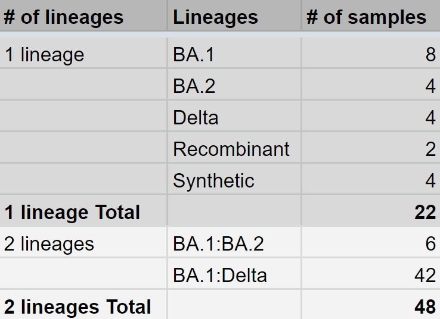

<small>Albert-Ludwigs University Freiburg</small>

<small>Department of Computer Science</small>

<small>Bioinformatics Group</small>

<small>Master Thesis</small> 

##### **Development and evaluation of Galaxy pipelines for detection of SARS-CoV-2 variants by genomic analysis of wastewater samples**

<small>Author: Polina Polunina</small>

<small>Examiner: Prof. Dr. Rolf Backofen</small>

<small>Second Examiner: Prof. Dr. Wolfgang R. Hess</small>

<small>Advisors: Dr. Berenice Batut, Dr. Wolfgang Maier</small>

---

Table of contents

### Table of contents
- **Introduction**
- **Methods**
    - Workflows
    - Datasets
- **Results**
    - Mock dataset
    - Real-world dataset
- **Discussion**
    - Limitations
    - Next steps
- **Summary**

---

Introduction

## Introduction

<small>SARS-CoV-2 evolution</small>

<small style="position: absolute; right: 0%; font-size: 0.2em; bottom: -0.5%;">Source: nextstrain.org</small>

<small>SARS-CoV-2 geography</small>

<small style="position: absolute; right: 0%; font-size: 0.2em; bottom: -0.5%;">Source: nextstrain.org</small>

Note:
- 1
- >640 million people affected by SARS-CoV-2 pandemic after almost 3 years after the first report of SARS-CoV-2 in Wuhan, China. SARS-CoV-2 is a virus that causes COVID-19 disease. In the first year of the Coronavirus pandemic, the virus did not change much. From approximately spring of 2020 on, SARS-CoV-2’s evolution tree grew increasingly complex.
- Different branches appeared for a number of variants: Omicron, Gamma, Alpha, Delta and others. Researchers track the SARS-CoV-2 variants with mutations that are clinically or epidemiologically significant. Detecting variants in a virus is important, one can determine if new variants are emerging or existing ones are spreading. In particular, variants with the potential or demonstrated ability to be more transmissible, immune evasive have to be tracked.
- >4000 unique labs submitting data to the GISAID database
- submitted data have to be immediately analyzed to monitor emergence and spread of new variants as well as understand the viral evolution dynamics.
- 2
- Nevertheless, transparent and freely available infrastructure for such analysis is not present everywhere. It is often the case that infectious disease outbreaks occur in remote areas without adequate infrastructure or in political situations that make unbiased interpretation of results impossible.

------

SARS-CoV-2 surveillance

### SARS-CoV-2 surveillance

<small>Main steps to be done for bioinformatics of SARS-CoV-2 surveillance</small>

Note:
- 1 
- A variety of surveillance techniques are available for SARS-CoV-2. Clinical testing is one of the most potent and widespread method. 
- Here is a simplified process that raughly represents sars-cov-2 surveillance. Sample collection -> Library preparation that can vary depending on type of biological data and final objectives -> sequencing where different techniques ara available to choos depending on data and objectives -> bioinformatics step intended for downstream analysis
- 2
- Let's look at Bioinformatics part a bit more in detail
- 3
- Here is simplified process of bioinformatics steps used to analyze sequenced data for sars-cov-2 surveillance. Tools can differ from one pipeline to another. But the main steps, in general, are more or less the same. 
- primer trimming, is a specific step for ampliconic datasets. The auxiliary file is used for this step - a BED file specifying the primers used during amplification.

------

Galaxy effort

#### Galaxy effort for clinical surveillance

<small style="position: absolute; right: 0%; font-size: 0.2em; bottom: -1%;">Source: Maier et al., 2021</small>

- transparency, accessibility, reproducibility
- 4 workflows for **clinical** SARS-CoV-2 data surveillance can be repurposed
- automated **bots** for regular data analysis

Note:
- 1
- Galaxy is one of the process managers that provides transparency, accessibility, reproducibility
- In order to respond global SARS-CoV-2 emergency, based on Galaxy there were developed **4 workflows** for clinical SARS-CoV-2 data surveillance
- These Galaxy workflows suggested by Wolfgang Maier and collegues in principle are divided into two stages: 1 - produces summaries on variant calling and mutation annotation, while 2 - interprets and visualize. 
- Workflows depend on type of input data, library preparation technique used to extract input data and sequencing technology used to obtain reads.
- 2
- Additionally, Galaxy team has developed **bots** to assist in SARS-CoV-2 surveillance, a viable tool for automating the analysis of a large number of SARS-CoV-2 sequences regularly.
- Galaxy workflows developed for SARS-CoV-2 clinical surveillance have shown adequate results. There are, however, some limitations. Currently, Galaxy workflows do not focus on wastewater surveillance. Thus, Galaxy workflows can be improved and repurposed to aim for SARS-CoV-2 wastewater surveillance. The current thesis attempts to focus on it.

------

Wastewater surveillance

### Wastewater surveillance

<small>

**Pros**
- variant detection 2 weeks sooner vs clinical
- detection in sewage even when SARS-CoV-2 prevalence is low
- more economical
- can cover 'seqiencing deserts'

**Cons**
- less accurate detection vs clinical testing
- data are anonymized
- difficult to quantify the number of infected people
- cannot show completely unbiased picture because of population mobility

</small>

Note:
- 1
- wastewater surveillance has received extensive public attention as a passive monitoring system that complements clinical surveillance.
- Schematic diagram shows the process of detecting viruses by WWS against clinical surveillance.
- upper branch shows a clinical surveillance of sars-cov-2, from the infection moment to bioinformatics data analysis
- lower branch, in turn, represents wastewater surveillance
- 2
- WWS seems to be an effective decision:
- (+): ww methods allow the detection of outbreaks before the first positive clinical tests are reported
- (+): virus RNA is detected in sewage even when COVID-19 prevalence is low
- (+): wws is more economical than clinical testing since it can screen
- large numbers of people with just a few samples and does not need clinician involvement
- (+): by using the wws, data can be collected from people who do not have access to healthcare or in places, so-called 'sequencing deserts', around the world where sequencing capacity is limited
- (-) wws is more challenging to detect viruses accurately in wastewater, compared to clinical testing. Prior to virus concentration, large quantities of sewage sludge should be filtered. Molecular analyses, like PCR, can be hindered by concentration techniques that damage genomic material. Furthermore, sewage contains a wide variety of other microbes and viruses, which may produce false positive results, as well as human DNA.
- (-): Because it contains human DNA, ww data need to be anonymized due to privacy concerns. However, pathogenic surveillance has the task of linking genetic information with the clinical manifestations and immunological status of patients => wws is limited in this regard, and it is able to provide only coarse population-level information.
- (-): ww detection efforts can be hindered by spreading a pathogen by infected people passing through a region

------

State-of-the-art

### State-of-the-art

Note:
- various state-of-the-art methods already presented to the public
- They can be divided into: 1) individual tools which require data preprocessing before sars-cov-2 lineages detection; 2) standalone pipelines that provide the entire analysis from raw data to lineages abundances detection
- state-of-the-art methods have differences in their goals, models, tools used and outputs

------

Aim of the thesis

### Aim of the thesis

Develop pipelines for SARS-CoV-2 wastewater data analysis that is:
- complete
- accessible
- reproducible
- transparent
- regular

Note:
- 1
- In this master thesis, I aim to provide a complete workflow based on Galaxy that can ensure data analysis transparency and reproducibility.
- I intended to adapt the Galaxy workflows developed for clinical data to process wastewater data, taking subworkflows for preprocessing data, improving these subworkflows.
- then, integrate existing tools for sars-cov-2 lineages abundances analysis in wastewater samples
- then, test these workflows on mock datasets as well as real datasets, and benchmark them against each other and with other solution offered by other researchers.
- 2
- for this purpose, I identified the tasks that I intended to complete in this thesis

---

Methods

### Methods

2 workflows:
- metatranscriptomic-illumina
- ampliconic-illumina

2 branches:
- Freyja-based
- COJAC-based

Extra steps:
- decontamination step
- taxonomic analysis

Note:
- 1
- In this thesis 2 wfs were created based on input data: illumina-ampliconic + illumina-metatranscriptomic
- Freyja and COJAC tools were chosen to be implemented into Galaxy wfs. 
- -> 2 branches were built: freyja-based and cojac-based
- now i want to have a look at both workflows
- 2
- I highlighted in yellow the blocks added by me as part of the work on this thesis. 
- first wf was built for ampliconic input data
- talk about extra steps and then branches
- wrappers were written with planemo (a command-line application for creating Galaxy tools, workflows, and deploying tools to Galaxy)
- 3
- second wf was built for metatranscriptomic data
- only freyja, cojac was not used because cojac can work only fro ampliconic data

------

Datasets

### Datasets

Workflows were tested on:
- mock dataset
- real-world dataset

------

Mock dataset

### Mock dataset

Note:
- Generation of mock dataset: Delta, BA.1, BA.2, recombinant (lineages combined from 3 lineages) as well as synthetic lineage;
- Single lineage vs Two lineages
- Comparison Freyja, COJAC, and Lineagespot results with expected results

------

Real-world dataset

### Real-world dataset

Note:
- In order to provide a fairly comprehensive analysis, real-world datasets for experiments in this thesis were selected in such a way that they cover a variety of locations in the world and different time points of collecting samples. 
- Four datasets: 
- i) one dataset from California where the samples were collected in 2020 
- ii) a dataset from the UK, with data collected in sewage across six major urban centers in the UK (with a total population equivalent of 3 million) around the same time period (late spring - early summer of 2020) as the Californian dataset
- iii) a dataset from wastewater treatment facilities across Ontario, Canada collected in the end of 2021 and beginning of 2022
- iv) a dataset from the US, one of the most extensive dataset with 418 samples already and regularly new samples are being added (last samples being from October of 2022). This dataset would be interesting to connect to Galaxy bots for regilar analysis

---

Results

## Results

------

Results on mock dataset

### Results on mock dataset
#### Single lineage expected

Note:
- 1
- **Barplot:**
- I analyzed separately samples were single lineage was expected. I compared results on these samples produced by COJAC-based and Freyja-based Galaxy workflows, as well as by one of the workflows that is not Galaxy but one of state-of-the-art solutions called Lineagespot.
- (brown and purple) All three tools are  quite effective in detecting expected lineage. Nonetheless, in discerning only expected lineage and nothing more, Lineagespot performed the best, compared to COJAC and Freyja. Freyja is effective at detecting expected lineage; however, it always detected some unexpected lineages. COJAC’s results are close to Freyja’s results, but COJAC was able to detect 2 samples with the expected lineage. 
- (yellow and blue) In 6 samples out of 22 Freyja and COJAC detected either unexpected lineages or nothing 
- **Venn upset diagram:**
- Using venn upset diagram, I analyzed intersections between sets of results and determined which samples were correctly detected by which tool (in terms of the lineages expected) and how similar the results were between tools.
- Each column corresponds to a set of obtained results from certain tools (COJAC, Lineagespot, Freyja), and bar charts on top show the size of the set of tool’s results. The first row in the figure is completely empty, while 1 sample is expected to be detected but was not. This specigic sample is expected to contain only unknown synthetic lineage.
- 2
- Distplot: distribution of the proportion of lineage detected by Freyja and COJAC among samples in the Single lineage group was plotted. Looking at fig of distribution, I conclude that for single lineage detection, the results of lineage proportion from COJAC and Freyja are from 0.9 to 1.
- However, some differences between Freyja and COJAC results are observed. Freyja showed a lower proportion of expected lineage, while for COJAC the proportion tends to 1 which is good because it's expected. So, COJAC results for the single lineage group are closer to what was expected.
- 3
- Parallel coordinates plot was generated for 22 samples where single lineage was expected.
- For a single lineage group of samples compare Delta, BA.1, BA.2 lineage proportions detected by Freyja and COJAC with each other as well as with expected proportion. The left axis represents the expected proportion of the lineage, the middle axis represents the proportion of the lineage detected by COJAC, while the right axis represents the proportion of the lineage detected by Freyja.
- Overall, proportions of lineages expected and detected by COJAC and Freyja close to each other
- In one curious case for 2 samples BA.1 lineage was not expected but COJAC detected its proportion close to 1. These two samples containg recombinant of all 3 lineages (Delta, BA.1, BA.2). For these 2 samples, it was expected to detect the recombination of three (BA.1, BA.2, and Delta) lineages, but not each of these lineages separately. This recombinant contains BA.1 lineage mutations, and that’s why COJAC misinterpreted results for these samples.

------

### Results on mock dataset
#### Two lineages expected

Note:
- **Barplot**
- The same analysis was done for 48 samples of mock dataset where 2 lineages were expected.
- (blue) In this case COJAC and Freyja showed adequate results in detecting both expected lineages.
- (dark blue) Lineagespot, in turn showed less efficient results, however, in terms of detection only 2 expected lineages and nothing more Lineagespot performed better.
- **Venn Upset:**
- looking at venn diagramm, on can see 15 same samples were detected to contain expected lineages by all tools
- Three samples that were not detected by any tool are distinct from other samples by belonging to the “low coverage” group.

------

Results on real dataset

### Results on real dataset
#### US dataset

Note:
- Results from Freyja and COJAC on the US dataset are obviously not the same.
- The curious fact is detecting the considerable prevalence of the **Delta in summer 2022 by COJAC** and not detecting it by Freyja.
- And more expected that both tools found Delta at the end of 2021 and the prevalence of Omicron (both BA.1 and BA.2 sub-lineages) in 2022.
- (optional) Interestingly, the BA.1 lineage was prevalent from January to March 2022, while BA.2 from April to June 2022.

------

### Results on real dataset
#### UK dataset

Note:
- After getting results on UK dataset dashboard was generated to show lineage prevalence in samples
- Interestingly, B.1.1.514 and B.1.1.301 lineages were in wastewater samples at the end of March 2020, and in April 2020.
- In Pango database they were registered on 1 and 22 May 2020, respectively.
- This fact proves earlier detection within wastewater surveillance over clinical surveillance.

---

Discussion

### Discussion
#### Limitations 

**Freyja-based workflow:**
- detects unexpected lineages
- when too many lineages - issues with plotting

**COJAC-based workflow:**
- for ampliconic datasets only
- can misinterpret recombinants

------

### Discussion
#### Next steps

- Publich workflows to WorkflowHub
- Create tutorials
- Connect to Galaxy bot
- Connect to CoV-Spectrum
- **Globally:** repurpose to other wastewater genomic surveillance

Note:
- CoV-Spectrum is an interactive platform aiming to assist scientists in investigating and identifying SARS-CoV-2 variants
- WorkflowHub is a registry for describing, sharing and publishing scientific computational workflows. The registry supports any workflow in its native repository. WorkflowHub aims to facilitate discovery and re-use of workflows in an accessible and interoperable way. This is achieved through extensive use of open standards and tools, including Common Workflow Language (CWL), RO-Crate, BioSchemas and TRS, in accordance with the FAIR principles.
- FAIR Findability, Accessibility, Interoperability, and Reusability foundational principles.
- poliovirus
- In recent two years, increased public awareness of any suspicious virus, including poliovirus, and ubiquitous usage of wastewater surveillance of poliovirus are preventing any cases of paralysis following the recent re-emergence of polio in New York

---

Summary

### Summary

<small>Development and evaluation of Galaxy pipelines for detection of SARS-CoV-2 variants by genomic analysis of wastewater samples</small>

Note:
- in accordance with the tasks that were set while working on this thesis, here is a list of completed tasks and the intention to complete unfinished tasks

------

### Thanks to:

---

Thanks for you attention!