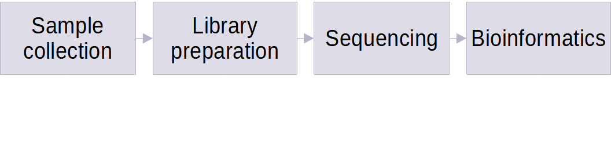

<small>Albert-Ludwigs University Freiburg</small>

<small>Department of Computer Science</small>

<small>Bioinformatics Group</small>

<small>Master Thesis</small>

##### **Development and evaluation of Galaxy pipelines for detection of SARS-CoV-2 variants by genomic analysis of wastewater samples**

<small>Author: Polina Polunina</small>

<small>Examiner: Prof. Dr. Rolf Backofen</small>

<small>Second Examiner: Prof. Dr. Wolfgang R. Hess</small>

<small>Advisors: Dr. Berenice Batut, Dr. Wolfgang Maier</small>

---

Table of contents

### Table of contents
CHANGE
- **Introduction**
    - SARS-CoV-2 surveillance
    - Galaxy?
    - Wastewater surveillance
    - State-of-the-art
- **Methods**
- **Results**
    - Mock dataset
    - Real-world dataset
- **Discussion**
    - Limitations
    - Next steps
- **Summary**

---

Introduction

## Introduction

<small style="position: absolute; right: 0%; font-size: 0.2em; bottom: -1%;">Source: nextstrain.org</small>

------

SARS-CoV-2 surveillance

### SARS-CoV-2 surveillance

<small>Main steps to be done for bioinformatics step of SARS-CoV-2 surveillance</small>

#### Galaxy effort

<small>Source: Maier et al., 2021</small>

#### Galaxy effort

- transparency, accessibility, reproducibility
- 4 workflows for **clinical** SARS-CoV-2 data surveillance can be repurposed
- automated bots for regular data analysis

------

Wastewater surveillance

### Wastewater surveillance

<small>Clinical surveillance vs Wastewater surveillance</small>

#### Galaxy effort

**Pros**
- variant detection 2 weeks sooner vs clinical
- detection in sewage even when SARS-CoV-2 prevalence is low
- more economical
- can cover 'seqiencing deserts'

**Cons**
- less accurate detection vs clinical testing
- data are anonymized
- difficult to quantify the number of infected people
- cannot show completely unbiased picture because of population mobility

------
TGS technologies: PacBio

### TGS technologies: PacBio

<small>Average read length between 20 kb and 30 kb. Low error rate (99.9%).</small>

---

Information storage

## Information storage

------

File formats: FASTQ

### Information storage: FASTQ datatype

------

File formats: Phred score

### Information storage: Phred quality score

<pre><code data-trim data-noescape >
@ERR4760040.1 MN00415:74:FREIBURG:1
TATAGCTCGCAAATCGTATCAGCAGATGTAATCAGGTAATGAAGTAGTTCTAGTTCTAGTTCTA
+
&%%)'/5516:;-,*&,)+1.-3(+-)%&+623196366-+-')*029==*029==*029==*0
</code></pre>

Phred quality score is used to indicate the measure of base quality in DNA/RNA sequencing. 

$$
Q = -10\log_{10}p \rightarrow p = 10^{\frac{-Q}{10}}
$$

 <small>*p: error probability associated with any given basecall*</small> 
<small>*Q: quality score, encoded in ASCII characters*</small>

------

Information storage: SAM/BAM datatype

### Information storage
#### SAM/BAM datatype

 

---

Applications of sequencing technologies

## Applications of sequencing technologies

------

Genome assembly

### Genome assembly

Source: https://www.genome.gov
    

------

### Genome assembly
#### VGP *de novo* assembly workflow

- The VGP-Galaxy project has assembled 26 genomes in the last 6 months
- Largest: 4Gbp *Gastrophryne carolinensis*

------

### Genome assembly
#### Within-species variation: resequencing

<small>The butterfly genus *Heliconius* contains species that are extremely difficult to tell apart.</small>

<small><small>Source: nature.com</small></small>

------

Transcriptomics: expression analysis

### Transcriptomics: RNA-seq

<small><small>Source: metrics-lab.github.io</small></small>

------

### Transcriptomics: RNA-seq
#### Differential expression analysis pipeline

<small><small>Source: nature.com</small></small>

------

### Transcriptomics: RNA-seq
#### Cancer prognosis by gene expression analysis

------

### Epigenetics

------

Epigenetics
    
### Epigenetics

Epigenetics is the study of **stable and inheritable phenotypic changes** that do not involve alterations in the DNA sequence.

 

It involves multiple mechanisms:
    
- Covalent modifications (e.g. DNA/RNA methylation)
- Histone positioning
- Histone variants
- Many more!

Detection requires usually  a three-phase strategy:

 

- Conversion of epigenetic into genetic information
    - Usually by biochemical methods
- High-throughput sequencing
- Computational and statisticall analysis

------

DNA/RNA methylation

### Epigenetics
#### Covalent modifications: DNA/RNA methylation

<small>DNA/RNA methylation **regulates gene expression** by recruiting proteins involved in gene repression or by inhibiting the binding of transcription factor(s) to DNA.</small>

<small>Bisulfite sequencing involves the deamination of unmodified cytosines to uracil.</small>

------

Cancer molecular markers

### Epigenetics
#### Identification of cancer molecular markers

<small><small>Source: nature.com</small></small>

------

Plant resistance to extreme conditions

### Epigenetics
#### Evaluation of plant resistance to extreme conditions

<small><small>Plant stress memory and their capacity to influence plant tolerance to a changing environment and crop productivity is considered to play an important role in the adaptation and evolution of plants.</small></small>
    

<small>"Hereditary changes can be induced by changing environmental conditions."  <small>Trofim Denisovich Lysenko (1898-1976)</small></small>

------

Neurodegenerative disorders

### Epigenetics
#### Neuroepigenetics: study of psyquiatric disorders

 
Psichyatric disorders influenced/associated by epigenetic modifications:
  

- Schizophrenia
- Rubinstein-Taybi syndrome
- Huntington's disease
- Fragile X syndrome

------

### Epigenetics
#### Neuroepigenetics: substance abuse disorders

<small><small>Five genes over-burdened by epigenetic modifications: ASTN2, KCNMA1, DUSP4, GABBR2, ENOX1.</small></small>

------

### Epigenetics
#### Neuroepigenetics: intergenerational transmission of fear

 
Animal studies in rats have shown that:
  

- Persistent fear-related memory behaviour is dependent on *de novo* DNA methylation [1].
    - DNA-methyltransferases (DMT) inhibitors block the formation of traumatic memories.
- Genetic imprint from traumatic experiences carries through at least two generations [2].

<small> 
[1] Bali P, Im HI, Kenny PJ. Methylation, memory and addiction. Epigenetics (2011). https://doi.org/10.4161/epi.6.6.15905  [2] Callaway, E. Fearful memories haunt mouse descendants. Nature (2013). https://doi.org/10.1038/nature.2013.14272
</small>

---

Thanks for you attention!