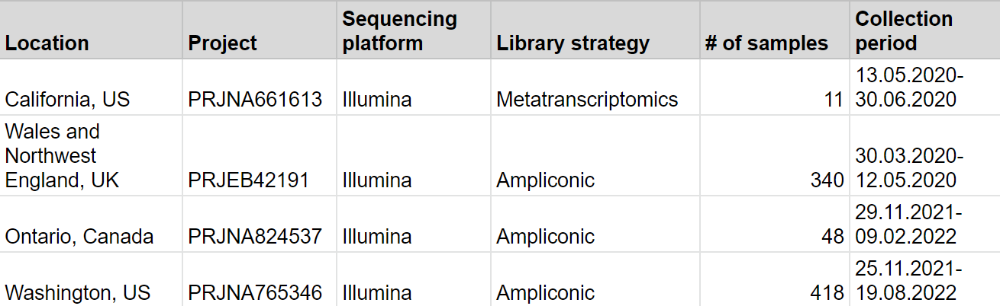
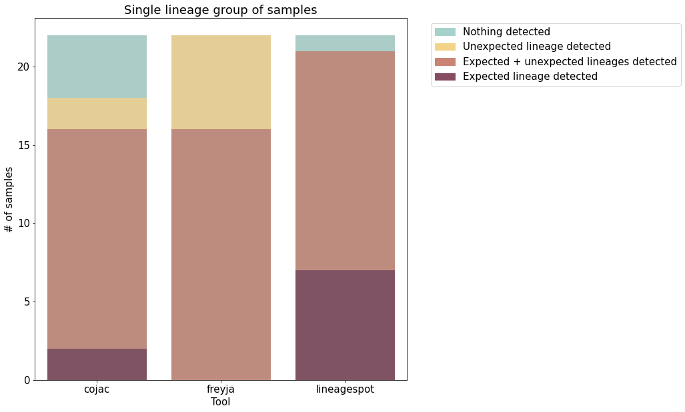
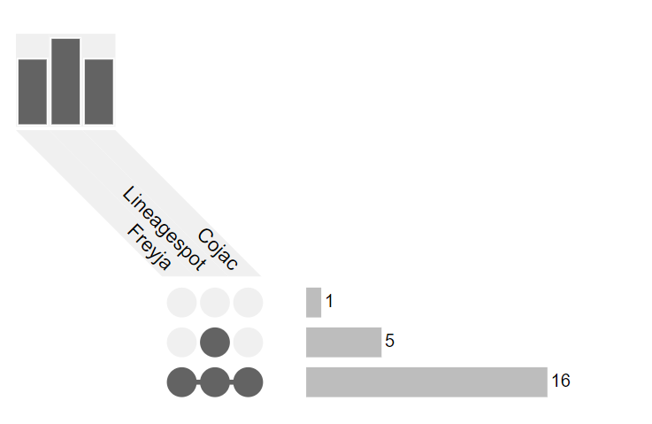

<small>Albert-Ludwigs University Freiburg</small>

<small>Department of Computer Science</small>

<small>Bioinformatics Group</small>

<small>Master Thesis</small>

##### **Development and evaluation of Galaxy pipelines for detection of SARS-CoV-2 variants by genomic analysis of wastewater samples**

<small>Author: Polina Polunina</small>

<small>Examiner: Prof. Dr. Rolf Backofen</small>

<small>Second Examiner: Prof. Dr. Wolfgang R. Hess</small>

<small>Advisors: Dr. Berenice Batut, Dr. Wolfgang Maier</small>

---

Table of contents

### Table of contents
CHANGE
- **Introduction**
    - SARS-CoV-2 surveillance
    - Galaxy?
    - Wastewater surveillance
    - State-of-the-art
- **Methods**
- **Results**
    - Mock dataset
    - Real-world dataset
- **Discussion**
    - Limitations
    - Next steps
- **Summary**

---

Introduction

## Introduction

<small style="position: absolute; right: 0%; font-size: 0.2em; bottom: -1%;">Source: nextstrain.org</small>

------

SARS-CoV-2 surveillance

### SARS-CoV-2 surveillance

<small>Main steps to be done for bioinformatics of SARS-CoV-2 surveillance</small>

------

Galaxy effort

#### Galaxy effort for clinical surveillance

<small style="position: absolute; right: 0%; font-size: 0.2em; bottom: -1%;">Source: Maier et al., 2021</small>

- transparency, accessibility, reproducibility
- 4 workflows for **clinical** SARS-CoV-2 data surveillance can be repurposed
- automated bots for regular data analysis

------

Wastewater surveillance

### Wastewater surveillance

<small>

**Pros**
- variant detection 2 weeks sooner vs clinical
- detection in sewage even when SARS-CoV-2 prevalence is low
- more economical
- can cover 'seqiencing deserts'

**Cons**
- less accurate detection vs clinical testing
- data are anonymized
- difficult to quantify the number of infected people
- cannot show completely unbiased picture because of population mobility

</small>

------

State-of-the-art

### State-of-the-art

------

Aim of the thesis

### Aim of the thesis

Develop pipelines for SARS-CoV-2 wastewater data analysis that is:
- complete
- accessible
- reproducible
- transparent
- regular

---

Methods

### Methods

2 workflows:
- metatranscriptomic-illumina
- ampliconic-illumina

2 branches:
- Freyja-based
- COJAC-based

Extra steps:
- decontamination step
- taxonomic analysis

Note:
- Galaxy wfs showed decent results for clinical SARS=CoV-2 data surveillance and was based on Galaxy that can assure transparency, reproducibility and availability as well as regular analysis tools (bots) -> repurposing existing galaxy wfs
- First: evaluation of needs showed that the most of  available real-world data are extracted with ampliconic and metatranscriptomic approaches with Illumina sequencing methods ->
- focus on 2 wfs: illumina-ampliconic + illumina-metatranscriptomic
- Freyja and COJAC tools were chosen to be implemented into Galaxy wfs -> there were 2 wrappers created with Planemo
- 2 branches were created: freyja-based and cojac-based that can be run simultaneously to get both results

------

Datasets

### Datasets

Workflows were tested on:
- mock dataset
- real-world dataset

------

Mock dataset

### Mock dataset

Note:
- Generation of mock dataset: Delta, BA.1, BA.2, asa well as synthetic lineage; Single lineage vs Two lineages
- Comparison Freyja, COJAC, and Lineagespot results with expected results

------

Real-world dataset

### Real-world dataset

Note:
- In order to provide a fairly comprehensive analysis, real-world datasets for experiments in this thesis were selected in such a way that they cover a variety of locations in the world and different time points of collecting samples. 
- That is why the choice of my thesis fell on the four datasets: 
- i) one dataset from California where the samples were collected in 2020 at a wastewater interceptor; 
- ii) a dataset from the UK, with data collected in sewage across six major urban centers in the UK (with a total population equivalent of 3 million) around the same time period (late spring - early summer of 2020) as the previous dataset in order to show different proportions of different variants of the virus
- iii) a dataset from wastewater treatment facilities across Ontario, Canada collected by Canadian Research Institute for Food Safety, which is interesting to analyze because it contains one of the most recent datasets, the last sample was published in June of 2022;
- iv) a dataset from the US collected by the FDA Center for Food Safety and Applied Nutrition, one of the most extensive dataset with more than 340 samples already and regularly new samples are being added (last samples being from October of 2022). This dataset would be interesting to connect to Galaxy bots for regilar analysis

---

Results

## Results

------

Results on mock dataset

### Results on mock dataset
#### Single lineage expected

Note:
- Distplot: distribution of the proportion of lineage detected by Freyja and COJAC among samples in the Single lineage group was plotted. Looking at fig of distribution, I conclude that for single lineage detection, the results of lineage proportion from COJAC and Freyja are from 0.9 to 1.
- However, some differences between Freyja and COJAC results are observed. Freyja showed a lower proportion of expected lineage, while for COJAC the proportion tends to 1 which is expected. Thus, we can guess that COJAC results for the single lineage group are closer to what was expected.

------

### Genome assembly
#### VGP *de novo* assembly workflow

- The VGP-Galaxy project has assembled 26 genomes in the last 6 months
- Largest: 4Gbp *Gastrophryne carolinensis*

------

### Genome assembly
#### Within-species variation: resequencing

<small>The butterfly genus *Heliconius* contains species that are extremely difficult to tell apart.</small>

<small><small>Source: nature.com</small></small>

------

Transcriptomics: expression analysis

### Transcriptomics: RNA-seq

<small><small>Source: metrics-lab.github.io</small></small>

------

### Transcriptomics: RNA-seq
#### Differential expression analysis pipeline

<small><small>Source: nature.com</small></small>

------

### Transcriptomics: RNA-seq
#### Cancer prognosis by gene expression analysis

------

### Epigenetics

------

Epigenetics
    
### Epigenetics

Epigenetics is the study of **stable and inheritable phenotypic changes** that do not involve alterations in the DNA sequence.

 

It involves multiple mechanisms:
    
- Covalent modifications (e.g. DNA/RNA methylation)
- Histone positioning
- Histone variants
- Many more!

Detection requires usually  a three-phase strategy:

 

- Conversion of epigenetic into genetic information
    - Usually by biochemical methods
- High-throughput sequencing
- Computational and statisticall analysis

------

DNA/RNA methylation

### Epigenetics
#### Covalent modifications: DNA/RNA methylation

<small>DNA/RNA methylation **regulates gene expression** by recruiting proteins involved in gene repression or by inhibiting the binding of transcription factor(s) to DNA.</small>

<small>Bisulfite sequencing involves the deamination of unmodified cytosines to uracil.</small>

------

Cancer molecular markers

### Epigenetics
#### Identification of cancer molecular markers

<small><small>Source: nature.com</small></small>

------

Plant resistance to extreme conditions

### Epigenetics
#### Evaluation of plant resistance to extreme conditions

<small><small>Plant stress memory and their capacity to influence plant tolerance to a changing environment and crop productivity is considered to play an important role in the adaptation and evolution of plants.</small></small>
    

<small>"Hereditary changes can be induced by changing environmental conditions."  <small>Trofim Denisovich Lysenko (1898-1976)</small></small>

------

Neurodegenerative disorders

### Epigenetics
#### Neuroepigenetics: study of psyquiatric disorders

 
Psichyatric disorders influenced/associated by epigenetic modifications:
  

- Schizophrenia
- Rubinstein-Taybi syndrome
- Huntington's disease
- Fragile X syndrome

------

### Epigenetics
#### Neuroepigenetics: substance abuse disorders

<small><small>Five genes over-burdened by epigenetic modifications: ASTN2, KCNMA1, DUSP4, GABBR2, ENOX1.</small></small>

------

### Epigenetics
#### Neuroepigenetics: intergenerational transmission of fear

 
Animal studies in rats have shown that:
  

- Persistent fear-related memory behaviour is dependent on *de novo* DNA methylation [1].
    - DNA-methyltransferases (DMT) inhibitors block the formation of traumatic memories.
- Genetic imprint from traumatic experiences carries through at least two generations [2].

<small> 
[1] Bali P, Im HI, Kenny PJ. Methylation, memory and addiction. Epigenetics (2011). https://doi.org/10.4161/epi.6.6.15905  [2] Callaway, E. Fearful memories haunt mouse descendants. Nature (2013). https://doi.org/10.1038/nature.2013.14272
</small>

---

Thanks for you attention!